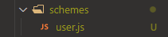

<!-- ALL-CONTRIBUTORS-BADGE:START - Do not remove or modify this section -->

<!-- ALL-CONTRIBUTORS-BADGE:END -->

<h1 align="center"> :busts_in_silhouette: EntityFactory :factory: </h1>

 Gera entidades de formulários (usuários, produtos, categorias etc) e envia para o body da requisição post de sua API 

 

<h2>:ballot_box: Dependencias </h2>

- axios : https://axios-http.com/docs/intro
- npm random : https://github.com/transitive-bullshit/random
- npm cross-env : https://www.npmjs.com/package/cross-env

 

<h2> :sunny: Get Started</h2>

~~~
> git init
> git clone https://github.com/Noctho01/EntityFactory.git
> npm install
~~~

 O diretorio deste programa está em /src, dentro voce encontrara o arquivo index.js que possui um pequeno codigo que vai automatizar o envio das requisiçoes POST para o     endereço endpoint especificado. 

 
 
<h2>:mechanical_arm: Executando programa </h2>

em um terminal windows com cross-env... 
a dependencia <code>cross-env</code> permite que seja possivel a declaração de varias variaveis de ambiente no CLI do windows

~~~~
> set SCHEME_ENV=usuario&& set QUANTITY_ENV=50&& set ROUTE_ENV=http://localhost:3000/registrar/usuario&& node src/index.js
~~~~

 

em um terminal linux...

~~~~
$ sudo SCHEME_ENV=usuario QUANTITY_ENV=50 ROUTE_ENV=http://localhost:3000/registrar/usuario node src/index.js
~~~~
 

 Dentro do diretorio do programa (fora de src) escreva este comando a cima. É preciso declarar as variaveis de ambiente para que o EntityFactor seja executado corretamente.

<b>Variaveis de Ambiente:</b>
 <li><code>SCHEME_ENV</code>: recebe o nome do esquema a ser usado</li>
 <li><code>QUANTITY_ENV</code>: recebe o numero de entidades que seram criadas</li>
 <li><code>ROUTE_ENV</code>: recebe a url da rota POST que recebera os dados</li>

 

  
<h2>:wrench::gear: Configurando </h2>

 O proposito final deste programa é aumotaizar o preenchimento de aplicações json usadas para enviar dados no corpo da requisição (atualmente suporta apenas o formato JSON).
Para isso EntityFactory faz juiz ao nome criando (fabricando) entidades especificadas pelo desenvolvedor, assim criando dados ficticios para serem enviados ao corpo da requisição POST/PUT/PATH... A chave para que EntityFactory crie essas entidades está nos esquemas 

<h3>:page_facing_up: Esquemas </h3>

 Encarregados de armazenar as regras de negocio da entidade, especificando quais são os campos para os fomularios/json e as regras para gerar seu valor aleatoriamente. 

 

<h3>:memo: Criando um esquema </h3>

 dentro do diretorio /src/schemes, crie um arquivo com o nome da entidade que pretende criar   Exemplo: <code>user.js</code>

 
 

 Este arquivo deve exportar um objeto que possua as regras (contrato), este objeto é o esquema da sua entidade

~~~~js
module.exports = {
  name: {
    require: false,
    models: ['Jhon', 'Mike', 'Sarah', 'Lessie']
  },
  email: {
    require: true,
    type: 'email',
    description: {
      minMax: [5, 10],
      include: ['aeioubdc', '123'],
      domainModels: ['gmail', 'hotmail', 'outlook']
    }
  },
  password: {
    require: true,
    type: 'string',
    description: {
      minMax: [8, 15],
      include: 'abc123',
      space: false,
      case: 'textCase'
    }
  }
}

// possivel resultado:
// {
//   name: 'Sarah',
//   email: 'aooiu2213@hotmail.com',
//   password: 'A2ccb1a3221'
// }
~~~~

<h4><code> require </code></h4>

 especifica se o campo é obrigatorio ou não, caso não seja, o campo pode ser ou não criado, a decisao é feita aleatoriamente

<h4><code> type </code></h4>

 usando DataTypes, deve informar qual será o tipo do valor deste campo
 
<ul>
  <li><b>email</b> ==> abc123@foo.com</li>
  <li><b>cpf</b> ==> gera um cpf valido sem pontos "xxxxxxxxxxx"</li>
  <li><b>date</b> ==> 1999/01/12 gera apenas datas, não gera horarios</li>
  <li><b>string</b> ==> valores em string, podem conter letras, numeros ou caracteres especiais (isso é determinado na propriedade <b><i>include</i></b> de string)</li>
  <li><b>inter</b> ==> valores inteiros do tipo numero</li>
  <li><b>float</b> ==> valores float do tipo numero</li>
  <li><b>booleano</b> ==> valores booleanos true, false || 1, 0</li>
</ul>

<h4><code> description </code></h4>

 Especifica as regras aplicadas naquele campo, porem elas seguem o seu tipo. Casa tipo de dados possui um grupo especifico de descriços

<h4> Campos de description </h4>

| campo           | type                                               | valores                                                    | função                                                                                                                                                                                          |
|-----------------|----------------------------------------------------|------------------------------------------------------------|-------------------------------------------------------------------------------------------------------------------------------------------------------------------------------------------------|
| space           | string Modelos                           | true/false or null                                         | especifica se o texto na string deve conter espaços entre palavras ex: space:true >> "Vitoria Reges" / space:false >> "VitoriaReges"                                                            |
| minMax          | string/inter/float | [valMin, valMax]                                           | valMin: valor minimo que pode ser gerado pelo programa valMax: valor maximo que pode ser gerado pelo programa  (obs: para o tipo string possui a funcionalidade de limitar o tamanho da string) |
| leng            | string                                   | numero inteiro                                             | valor fixo do tamanho da string                                                                                                                                                                 |
| case            | string                                   | 'camiCase', 'upperCase', 'lowerCase', 'textCase'           | valor em string dos tipos de case da string ex case: camiCase \|\| "camiCase" >> "FubarDeMilho"                                                                                           |
| include         | string/email                   | tipo email: ['abc', '123', '...'] tipo string: 'abc123...' | campo obrigatorio, especifica os caracteres que serão usados para gerar o valor do campo ex: <string> include: "bo15" >> "b1oob55" <email> include: ["bo", "15"] >> boob515@email.com           |
| dominionsModels | email                                    | ['gmail', 'hotmail', 'yahoo', '...']                       | campo obrigatorio para tipo email, especifica em um array os host de email                                                                                                                      |
| yMinMax         | date                                     | [anoMinimo, anoMaximo]                                     | especifica o ano minimo e maximo a ser gerado pelo programa ex: yMinMax: [2002, 2004] >> 2002 \|\| 2003 \|\| 2004                                                                               |
| mMinMax         | date                                     | [mesMinimo, mesMaximo]                                     | especifica o mes minimo e maximo a ser gerado pelo programa ex: mMinMax: [1, 12] >> 8 \|\| ...                                                                                                  |
| dMinMax         | date                                     | [diaMinimo, diaMaximo]                                     | especifica o dia minimo e maximo a ser gerado pelo programa ex: dMinMax: [1, 31] >> 19 \|\| ...                                                                                                 |
 

  
 <h2>:kaaba: Modelos </h2>
 
 Os modelos são valores que voce estabelece para que sejam escolhidos aleatoriamente para aquele campo em especifico, campos que possuem modelos não precisam ter um tipo, apenas usando a propriedade <code>modelos</code> e nele passando um array com os possiveis valores a serem escolhidos.  Dentro de /src/models voce deve criar um arquivo chamado models.js 

 
 ~~~~js
 // Exemplo de um arquivo modelos.js
 
 module.exports = {
    // Modelos aqui ...
    nomes: {
        primeiro: [
            'Gabriel', 'Gustavo', 'Pedro', 'Maria',
            'Rafael', 'Lucas', 'Alex', 'Barbara',
            'Natalia', 'Geni', 'Jose', 'Antonio',
            'Marcia'
        ],
        segundo: [
            'Dos Santos', 'Da Silva', 'Alencar',
            'De Nobrega', 'Diniz', 'Oliveira',
            'Dos Anjos', 'Gomes', 'Cunha',
            'Souza', 'Rodrigues'
        ]
    },
    emails: [
        'gmail', 'hotmail', 'alura',
        'yahoo', 'outlook', 'apple'
    ],
    paises: [
        'Brasil', 'Estados Unidos',
        'Argentina', 'China'
    ],

}
 ~~~~
 
 
 O mesmo deve exportar um objeto que possua chaves que voce possa usar como referencia, e seus valores devem ser arrays ou objetos com arrays. os valores dentro de cada array seram usados pelo EntityFactory para gerar strigns com valores aleatorios baseado nos modelos.

 
 <h3>:page_facing_up::kaaba: Esquemas com Modelos </h3>
 
 ~~~~js
 const Models = require('../models/models_examples')
 
 module.exports = {
   nome: {
     require: true,
     space: true,
     models: Models.nomes || ['Pedro', 'Carla', 'Marcos', 'Felipe', 'Angela'] || { primeiroNome: ['Pedro', 'Marcos'], segundoNome: ['Da Silva', 'Dos Santos'] }
   },
   tecnologias: {
     require: true,
     isArray: true,
     models: Models.tecnologias || {
       ['Java', 'Python', 'JavaScript', 'Go', 'TypeScript', 'PHP'],
       ['MySql', 'MongoDb', 'Postgree', 'SqlServer'],
       ['AWS', 'Google Cloud', 'Azure', 'Heroku'],
     }
   }
 }
 
 // resultado possivel:
 // {
 //   nome: "Pedro Da Silva",
 //   tecnologias: ['Python', 'MySql', 'Azure']
 // }
 ~~~~
 
 
 Na primeira linha importamos um modulo que possui os <b><i>Modelos</i></b> de dados que voce deve especificar em /src/modelos/modelo.js 

 
 
 como dito antes, ao criar um campo que utiliza modelos, não é informado o tipo do mesmo, <code>require</code> e <code>space</code> possuem a mesma função em campos tipados porem <code>space</code> não é uma propriedade de <code>description</code> quando se trata de um campo com modelos. 

 

 veja tambem que no segundo campo 'tecnologias', temo a propriedade <code>isArray</code>. 
ela diz ao EntityFactory que aquele campo é um array, assim voce pode definir o tamanho do array de uma maneira simples. Voce precisa especificar um modelo do tipo objeto e o numero de chaves sera o numero do tamanho deste array.
 
<i>exemplo:</i>
 

~~~~js
// esquema com um campo do tipo array
const frutas = {
  require: true,
  isArray: true,
  models: {
    alimentosChave1: ['Banana', 'Melancia', 'Melão', 'Maçã'],
    alimentosChave2: ['Amora', 'Uva', 'Mnga', 'Abacaxi'],
    alimentosChave3: ['Açaí', 'Abacate', 'Laranja', 'Morando'],
    alimentosChave4: ['Acerola', 'Cacau', 'Cajá', 'Caqui']
  }
}

// possivel resultado:
// {
//   frutas: ['Melancia', 'Uva', 'Açai', 'Caqui']
// {
~~~~
 

 

 como foram declaras 4 chaves no objeto em models, o resultado será um array com 4 campos

 
#

## Contributors ✨

Thanks goes to these wonderful people ([emoji key](https://allcontributors.org/docs/en/emoji-key)):

<!-- ALL-CONTRIBUTORS-LIST:START - Do not remove or modify this section -->
<!-- prettier-ignore-start -->
<!-- markdownlint-disable -->
<table>
  <tr>
    <td align="center"><a href="https://github.com/Noctho01"> <b>Vinicius dos Santos Rodrigues</b></a> <a href="#infra-Noctho01" title="Infrastructure (Hosting, Build-Tools, etc)">🚇</a> <a href="https://github.com/Noctho01/EntityFactory/commits?author=Noctho01" title="Tests">⚠️</a> <a href="https://github.com/Noctho01/EntityFactory/commits?author=Noctho01" title="Code">💻</a></td>
  </tr>
</table>

<!-- markdownlint-restore -->
<!-- prettier-ignore-end -->

<!-- ALL-CONTRIBUTORS-LIST:END -->

This project follows the [all-contributors](https://github.com/all-contributors/all-contributors) specification. Contributions of any kind welcome!
